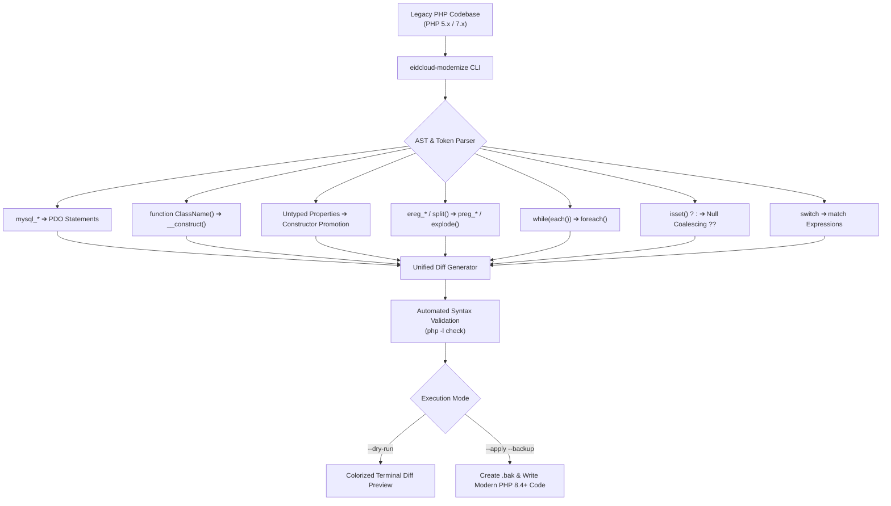

[🇸🇦 العربية](README.ar.md) | [🇬🇧 English](README.md)

# 🐘 eidcloud-php-modernizer

[](https://www.php.net/)
[](https://github.com/mhdshadi/eidcloud-php-modernizer)
[](LICENSE)
[](https://colab.research.google.com/github/mhdshadi/eidcloud-php-modernizer/blob/main/notebooks/quickstart.ipynb)

> Automated Legacy PHP Modernizer & Code Migrator upgrading PHP 5.x / 7.x procedural patterns and `mysql_*` to modern PDO and PHP 8.4+. Built with **zero external dependencies**.

---

## 🎯 Architecture & Workflow



---

## 🚀 Capabilities

| Legacy Pattern (PHP 5.x / 7.x) | Modernization Target (PHP 8.2 - 8.4+) | Transformer Engine |
| :--- | :--- | :--- |
| `mysql_connect()`, `mysql_query()` | `new \PDO()`, `PDOStatement` prepared calls | `MysqlToPdoTransformer` |
| `function ClassName()` | `public function __construct()` | `ConstructorTransformer` |
| `var $prop; $this->prop = $prop;` | Constructor Property Promotion `public $prop` | `PropertyPromotionTransformer` |
| `ereg()`, `eregi()`, `ereg_replace()` | `preg_match()`, `preg_replace()` | `EregToPregTransformer` |
| `split(',', $str)` | `explode(',', $str)` / `preg_split()` | `EregToPregTransformer` |
| `while(list($k,$v) = each($arr))` | `foreach ($arr as $k => $v)` | `EachToForeachTransformer` |
| `isset($x) ? $x : $default` | `$x ?? $default` | `NullCoalescingTransformer` |
| `switch ($v) { case: return ... }` | `return match ($v) { ... }` | `MatchExpressionTransformer` |

---

## 📦 Installation

Clone the repository or install via Composer:

```bash
git clone https://github.com/mhdshadi/eidcloud-php-modernizer.git
cd eidcloud-php-modernizer
```

Or require via Composer:

```json
{
  "require": {
    "eidcloud/php-modernizer": "^1.0"
  }
}
```

---

## 💻 CLI Usage

The modernized executable is located at `bin/eidcloud-modernize`:

### 1. Scan a Project for Obsolete Patterns
```bash
php bin/eidcloud-modernize scan ./legacy_project/
```

### 2. Dry-Run Upgrade with Side-by-Side Unified Diffs
```bash
php bin/eidcloud-modernize upgrade ./legacy_project/ --dry-run
```

### 3. Safely Apply Modernizations with Automatic Backups
```bash
php bin/eidcloud-modernize upgrade ./legacy_project/ --apply --backup
```

### 4. Display Help and Options
```bash
php bin/eidcloud-modernize --help
```

---

## 🧪 Automated Testing

`eidcloud-php-modernizer` comes equipped with a 100% zero-dependency automated test runner:

```bash
php tests/run_tests.php
```

All unit tests validate AST transformations, diff generation, and verify compilation using native `php -l`.

---

## 👨‍💻 Author & Maintainer

**Eng. MHD. Shadi AL-Hasan**  
EidCloud Architecture & Modernization Systems  

---

## 📄 License

This project is licensed under the [MIT License](LICENSE) - see the LICENSE file for details.  
Copyright (c) 2026 MHD. Shadi AL-Hasan.

---

## 👤 Author & Maintainer

**Eng. MHD. Shadi AL-Hasan**  
- **Role:** Executive CTO & Enterprise Solutions Architect  
- **Email:** [mhd.shadi.alhasan@gmail.com](mailto:mhd.shadi.alhasan@gmail.com)  
- **Phone / WhatsApp:** [+963934005922](tel:+963934005922)  
- **Location:** Damascus, Syria  
- **GitHub:** [shadialhasan](https://github.com/shadialhasan)  

---

## 📄 License

This project is licensed under the MIT License - see the [LICENSE](LICENSE) file for details.  
Copyright (c) 2026 **MHD. Shadi AL-Hasan**. All rights reserved.
